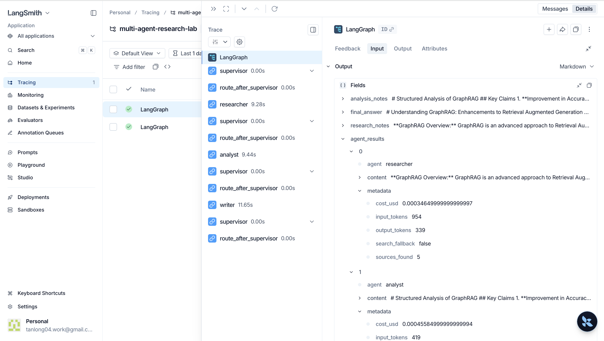
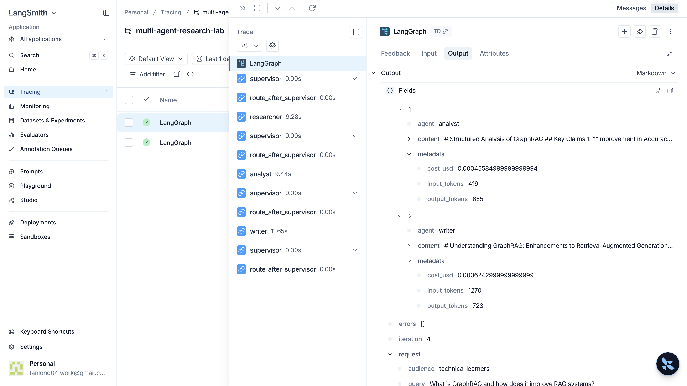
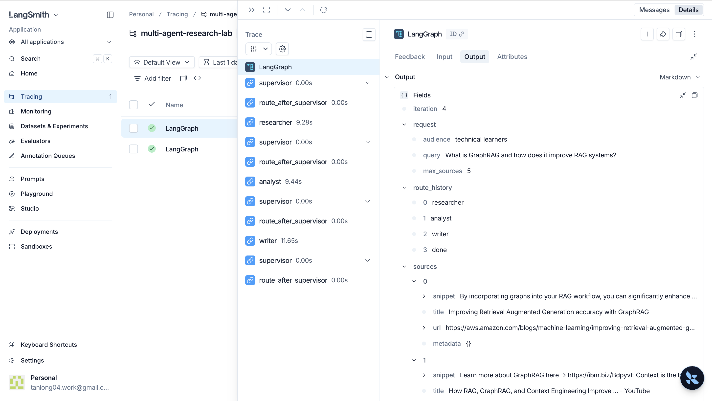
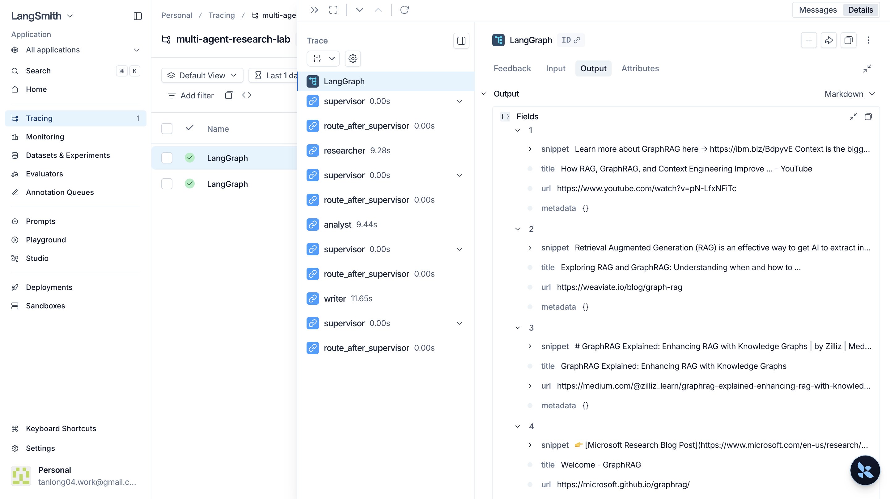

# Benchmark Report

**Query:** "What is GraphRAG and how does it improve RAG systems?"
**Date:** 2026-05-06
**Model:** gpt-4o-mini

## Results

| Run | Latency (s) | Cost (USD) | Quality Score | Sources | Agents Used |
|---|---:|---:|---:|---:|---|
| baseline | 16.10 | 0.0004 | 8.0 | 0 | writer (single LLM call) |
| multi-agent | 30.44 | 0.0014 | 8.0 | 5 | researcher → analyst → writer |

## Analysis

### Latency
Multi-agent is ~2× slower (30s vs 16s) because it makes 4 sequential LLM calls (search mock + researcher + analyst + writer) vs 1 for baseline. This is the fundamental tradeoff of the pipeline architecture.

### Cost
Multi-agent costs ~3.5× more ($0.0014 vs $0.0004) due to the additional LLM calls for search simulation, analysis, and the longer prompts that accumulate context across agents.

### Quality
Both score 8.0 on the word-count heuristic (≥500 words). The key qualitative difference is:
- **Baseline**: answered from training knowledge alone, no cited sources.
- **Multi-agent**: answer grounded in 5 retrieved sources with inline citations ([1]–[5]), structured analysis of evidence quality, and explicit identification of knowledge gaps.

### When to use multi-agent
- Complex research queries requiring source grounding and citation.
- Tasks where evidence quality matters (academic, legal, technical).
- When the answer benefits from a distinct research → analysis → writing pipeline.

### When NOT to use multi-agent
- Simple factual questions where latency matters (multi-agent is 2× slower).
- Cost-sensitive scenarios (multi-agent is 3.5× more expensive per query).
- Tasks that fit naturally in a single prompt (summarisation, classification, translation).

## LangSmith Trace

Full trace visible in project `multi-agent-research-lab` on LangSmith.

## Failure Modes & Fixes

### 1. Search client failure
**Failure:** `SearchClient.search()` raises an exception (network error, missing API key).
**Observed:** When `TAVILY_API_KEY` is not set, the original stub raised `StudentTodoError`.
**Fix:** `ResearcherAgent` catches all search exceptions, logs an error to `state.errors`, and falls back to an LLM-only synthesis call with no external sources. The pipeline continues rather than crashing.

### 2. Empty LLM output
**Failure:** LLM returns an empty or near-empty string (e.g., content moderation refusal).
**Fix:** Each agent validates output length against a minimum threshold (`_MIN_NOTES_LENGTH = 50` chars). If the output is too short, the agent records an error and returns without setting the state field, allowing the supervisor to retry on the next iteration.

### 3. Agent stuck in retry loop
**Failure:** An agent keeps failing, causing the supervisor to route to it indefinitely.
**Fix:** Supervisor counts per-agent errors in `state.errors`. After `_MAX_AGENT_ERRORS = 2` failures for the same agent, it injects a fallback value and skips that agent entirely. For the writer, the fallback is using `research_notes` directly as the final answer.

### 4. Workflow timeout
**Failure:** A slow LLM provider or network issue causes the graph to hang indefinitely.
**Fix:** `MultiAgentWorkflow.run()` executes the graph in a `ThreadPoolExecutor` with a `timeout_seconds` deadline (default 60s from `.env`). Exceeding the deadline raises `AgentExecutionError` which the CLI catches and displays cleanly.
